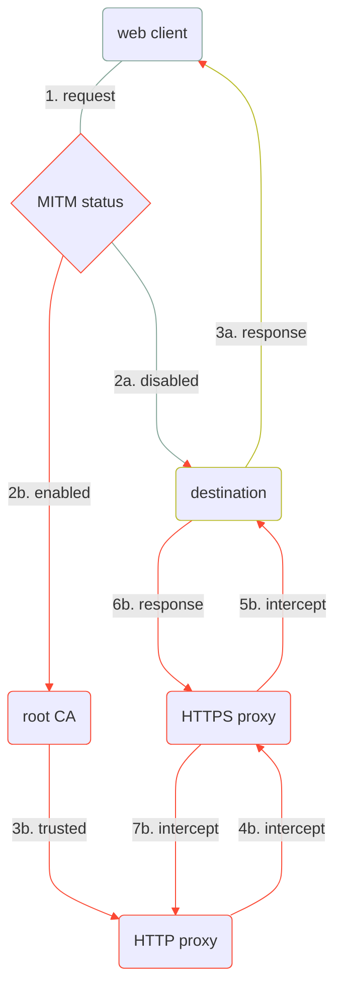

<div align="center">
    <h1>Not-in-the-Middle</h1>
    <i>:zap: <b>NITM</b> is a microservice that intercepts <b>HTTP/S</b> traffic, powered by <b>Node.js</b>. :zap:</i>
    <br>
</div>

<br>

<div align="center">

[](https://github.com/alesandar/nitm/actions/workflows/ci.yml)
[](https://github.com/alesandar/nitm/actions/workflows/ci.yml)

</div>

<br>

<div align="center">
    <b>This project is not even close to a stable release. Avoid using it outside the scope of your local environment.</b>
</div>


<br>
<br>


## :bookmark_tabs: Table of contents
- [Requirements](#octopus-requirements)
- [Configuration](#gear-configuration)
- [Certificates](#unlock-certificates)
- [Setup](#wrench-setup)
  * [Node.js](#nodejs)
  * [Docker](#docker)
  * [Docker Compose](#docker-compose)
- [ Usage](#rocket-usage)
  * [cURL](#curl)
  * [Chromium](#chromium)
  * [System-wide CA setup](#system-wide-ca-setup)
- [TODO](#snail-todo)
- [Flowchart](#arrows_clockwise-flowchart)


<br><br>


## :octopus: Requirements

- **Node.js** (required)
- **NPM** (required)
- **openssl** (optional, needed only if you have to generate a new CA)


<br>


## :gear: Configuration

**NITM** can be configured through a set of environment variables.<br>


Here is a table that represents all available configuration options.

| variable name | default value    | description           |
| :---          | :---             | :---                  |
| HTTP_HOST     | localhost        | public proxy host     |
| HTTP_PORT     | 8080             | public proxy port     |
| HTTPS_HOST    | localhost        | internal proxy host   |
| HTTPS_PORT    | 8443             | internal proxy port   |
| CA_KEY        | .cert/rootCA.key | path to root CA key   |
| CA_CERT       | .cert/rootCA.pem | path to root CA cert  |
| CA_PASS       | pass             | root CA password      |


More configuration options will be available soon.<br>
Feeling lucky with the default settings? Just proceed to the to [certificates](#unlock-certificates) section.<br><br>

If you would like to update the configuration, the easiest way would be to make a new copy of `env.example`.

```console
cp env.example .env
```


<br>


## :unlock: Certificates

In order to use **NITM**, your system or application should be capable of using a custom root CA.<br>
<br>
For testing purpose, you can simply rely on the pre-generated keys and forget about all of this.<br>
<br>
Otherwise, the name of the [generate-root-ca.sh](.bin/generate-root-ca.sh) script should be pretty self-explanatory.<br>
It has been used for the freely-distributed certificates under the [.cert](.cert) directory.<br>


<br>


## :wrench: Setup

### Node.js

Install the missing dependencies and start the service.

```console
npm install
npm run start
```

Alternatively, you can start the `dev` script, which will spawn `nodemon` process.

```console
npm install
npm run dev
```


### Docker

There is a GitHub workflow that automates the processes of building and publishing the image.<br>
The most recent image build is located at [alesandar/nitm:latest](https://hub.docker.com/layers/alesandar/nitm/latest/images/sha256-4c9c7aefa939bea284755021ee8c0f77c753fab900e2ca6586d495eec72d9600).
Looking for other another build? Inspect the public [tags](https://hub.docker.com/repository/docker/alesandar/nitm/tags).<br>
<br>
The command below create a new container, based on the latest build.<br>

```console
docker run -e HTTP_HOST=0.0.0.0 -p 127.0.0.1:8080:8080 -t alesandar/nitm:latest`
```

If you do not want to declare variables one by one, like we did above, just pass an environment file.<br>
In case you did not create an environment file earlier, please go back to the [setup](#wrench-setup) section.

```console
docker run --env-file .env -p 127.0.0.1:8080:8080 -t alesandar/nitm`
```

### Docker Compose

**Docker Compose** makes it even simpler, since most of the configuration is predeclared inside [docker-compose.yml](./docker-compose.yml).

```console
docker-compose up
```

For local development, you might want to pass the `--build` argument (it will build a local image).

```console
docker-compose up --build
```


<br>


## :rocket: Usage

### cURL
There's a simple cURL wrapper, located in [.bin/curl.sh](.bin/curl.sh), which must take care of all prerequisites.<br>

```console
.bin/curl.sh https://github.com
```

Alternatively, you can execute the actual cURL binary with the following arguments:

```console
curl --proxy localhost:8080 --cacert .cert/rootCA.pem https://github.com
```


### Chromium

The proxy server can be specified as a command-line argument, but that's not the case with the certificate authority.<br>
Users are required import certificate authorities manually. Follow this steps:
- open `Settings` and go to `Privacy and security` `Security` `Manage certificates`
- focus the `Authorities` tab and click on the `Import` button
- select the `Trust this certificate for identifying websites` checkbox and hit `OK`
- navigate to the project's root directory and select the [root CA](`.cert/rootCA.pem`).

As a final step, start the shell script by doing so:
```console
.bin/chromium.sh
```

Alternative, start Chromium like so:

```console
chromium --proxy-server=localhost:8080
```

Now open a website of your choice and take a look at the service logs.

### System-wide CA setup

The system-wide setup is untested and discouraged. If you want to experiment - do it at your own risk.<br>
Arch Linux users might wish to read the [Transport Layer Security/Certificate_authorities](https://wiki.archlinux.org/title/Transport_Layer_Security#Certificate_authorities).<br>
Anybody else should refer to the documentation of his current operating system.


<br><br>


## :snail: TODO

- performance and metrics:
  - implement a monitoring stack in [docker-compose.yml](./docker-compose.yml) (Prometheus, Grafana, ElasticSearch, etc)
  - create a custom Prometheus exporter for exposing request metrics
  - implement a compression algorithm, such as gzip/deflate/
  - implement a caching mechanism
- refactor:
  - rewrite the logic from [generate-root-ca.sh](.bin/generate-root-ca.sh) inside [cert.js](./src/lib/cert.js) and generate root CAs internally
  - create a method that verifies the validity of the root CA
  - follow permanent (301 and 308) and temporary (302, 303, 307) redirects 
  - rewrite some of the main methods (e.g. `initHTTP` and `initHTTPS`) into a class instances
  - use a method for inline documentation, such as **JSDoc**
  - consider rewriting the everything in TypeScript
  - decide what type of tagging/versioning system to use for releases
- features and improvements:
  - compile static binaries that will ease the distribution of the service
  - create a CLI module (e.g. `./src/lib/cli.js`) for interacting with the service through the command-line
- unit-testing:
  - choose a library (tape?)
  - write performance-oriented tests 
  - create a stress-testing environment for high load
- CI/CD:
  - push images to GitHub's registry as well
  - add a workflow for publishing to the NPM registry as well


<br><br>


## :arrows_clockwise: Flowchart

Finally, here is a flowchart that illustrates what the service does behind the scenes.
It requires a few improvement, but should be more than enough for now.


